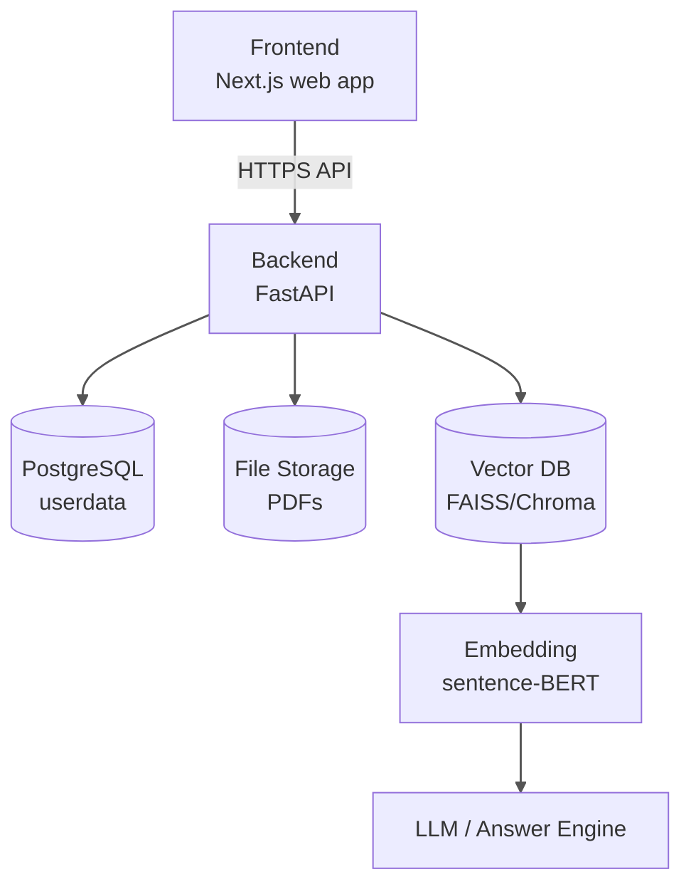
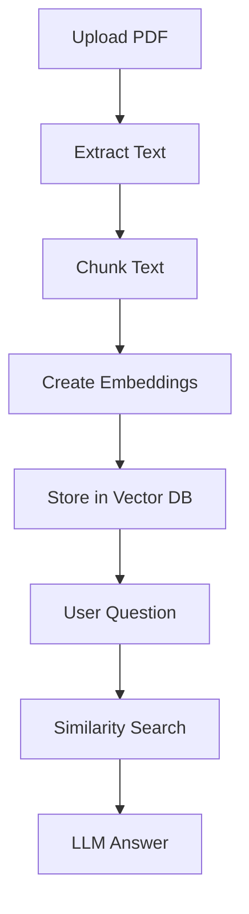

# AI_Academic_assistant_for_african_university_students
we students struggle with finding an AI to help explain concepts simply, to generate university standards questions, and summarizing lecture Pdfs. here is your solution then for all of it.  

here is the high level architecture diagram :

Next step would be a deailed RAG pipeline design.

